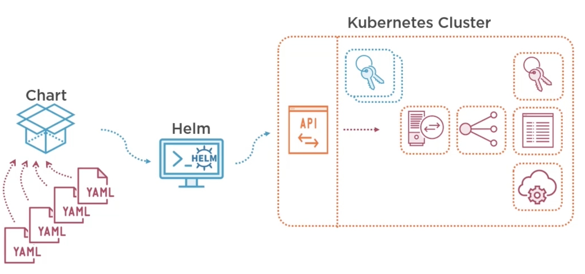
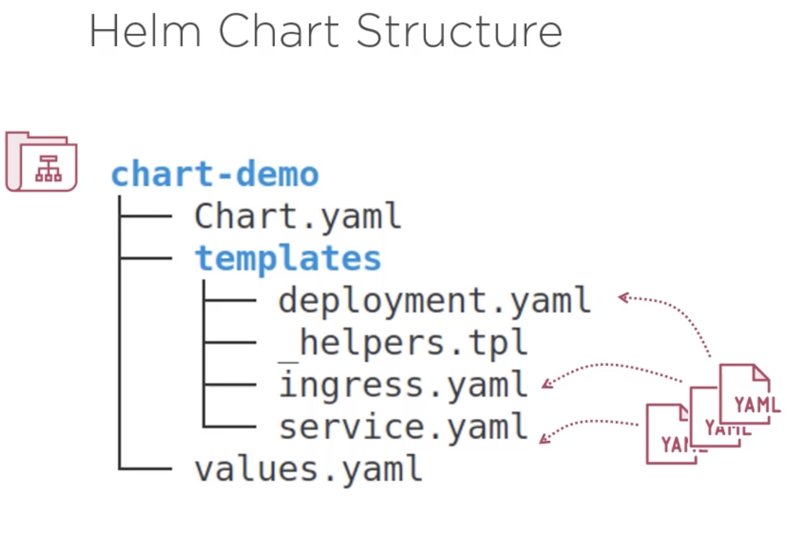
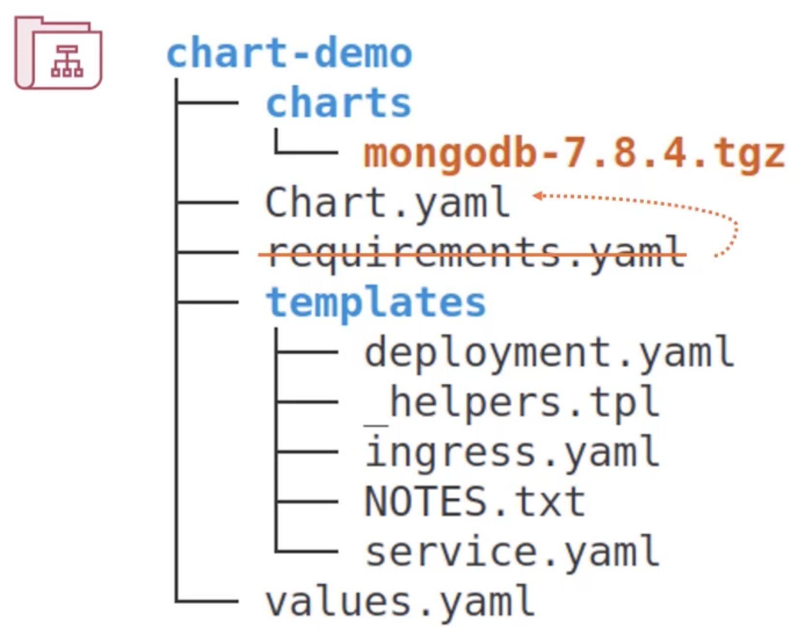
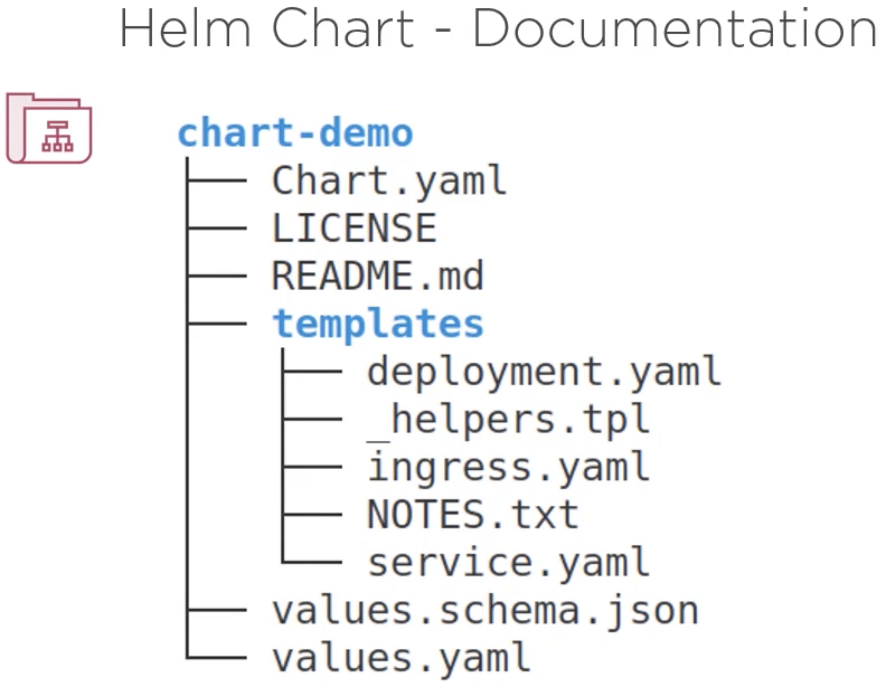
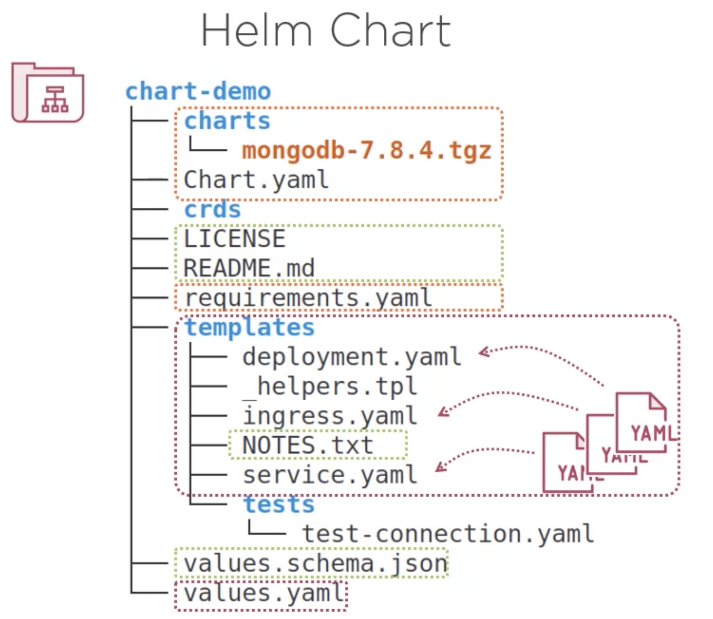
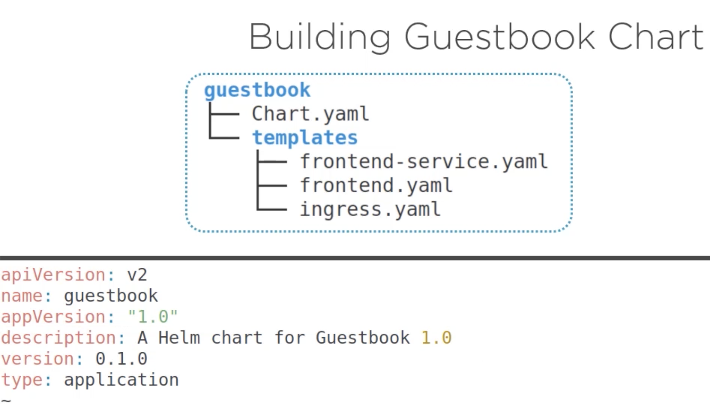

# HELM 3

Helm is a package manager for Kubernetes.




Chart is a definition of the application.
Releas is an instance of that chart.

Helm stores the released manifeste inside Kubernetes as secrets.

In Kubernetes you can group resources in virtual clusters called namespaces!

## Helm Charts



- Chart folder can be compressed as an archive.
- Folder name has the name of the chart.
- Chart properties are stored in Chart.yaml (There can be found: chart name, version & other metadata)
- Chart folder has templates subfolder contains K8S object definition files. There are not raw yaml files instead there are customizable templates with placeholders that are replaced by values using helper functions (see \_helprs.tpl inside of templates)



If the chart has subcharts or depends on external charts we can either add them as archives in the charts subfolder or reference them in the Chart.yaml or in the requirements.yaml. The requirements are here just for the compabiti with Helm 2. In Helm 3 we shoud put all the dependecies into Chart.yaml



- The chart can be documented in README.md
- LICENSE contains a license of the chart
- NOTES.txt is to display some information to the user after your chart is installed or updated (some usefull information eg. what to the next, the URL & port numbers of the services or a quick how to).
- values.schema.json to define the structure of the values.yaml file.



- Tests folder to be used for testing
- crds folder which used to create K8S customer resources definitions

### Chart.yaml

```
apiVersion: v2                                  # api for helm. v2 is referring to helm 3
name: chart-demo
description: A helm chart for Kubernetes        # optional
keywords:                                       # adding some keywords is useful to search for the
  - demo                                        # chart in a repository
type: application                               # it is a new for adding library
appVersion: 1.16.0                              # a version of the application to install w/ helm
version: 0.1.0                                  # version of the chart (Major. Minor. Patch)
dependencies:
  ...
```


